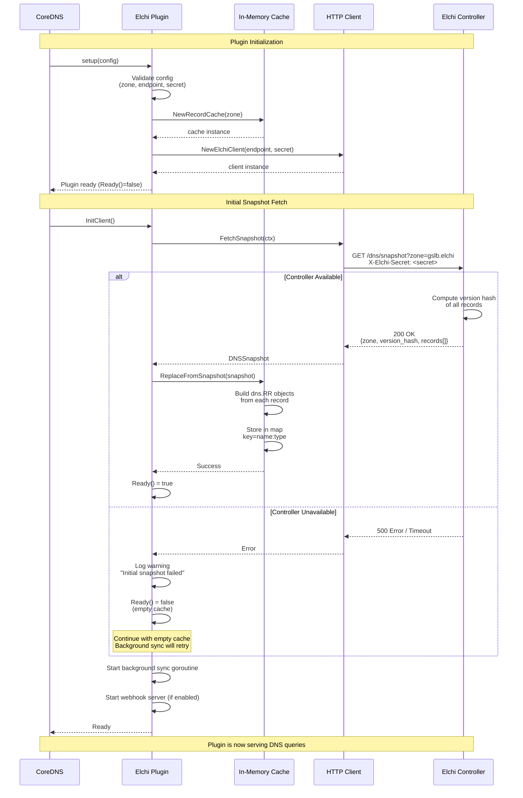

# Startup Flow

This diagram shows the plugin initialization and initial snapshot fetch.

## Key Points

1. **Non-blocking startup**: Plugin doesn't fail if initial snapshot fails
2. **Graceful degradation**: Starts with empty cache, retries in background
3. **Pre-built records**: RR objects built during cache load, not during queries
4. **Ready status**: `Ready()` returns true only after successful snapshot fetch
5. **Background sync**: Starts immediately to keep cache updated
