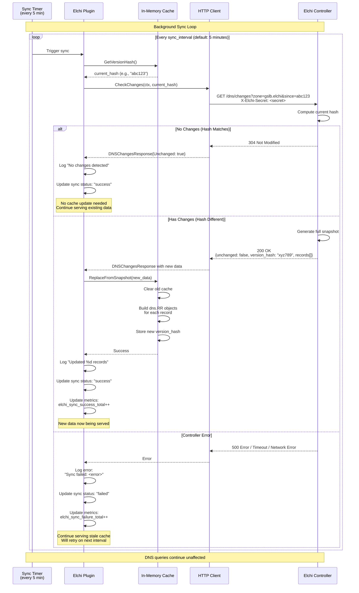

# Periodic Sync Flow

This diagram shows the background synchronization with hash-based change detection.

## Key Points

1. **Hash-based optimization**: Only transfers data when hash changes
2. **HTTP 304 efficiency**: No body sent when unchanged, saves bandwidth
3. **Atomic updates**: Cache replaced atomically, no partial state
4. **Error tolerance**: Sync failures don't stop DNS serving
5. **Metrics tracking**: Success/failure counters for monitoring
6. **Stale cache strategy**: Continue serving old data during errors
