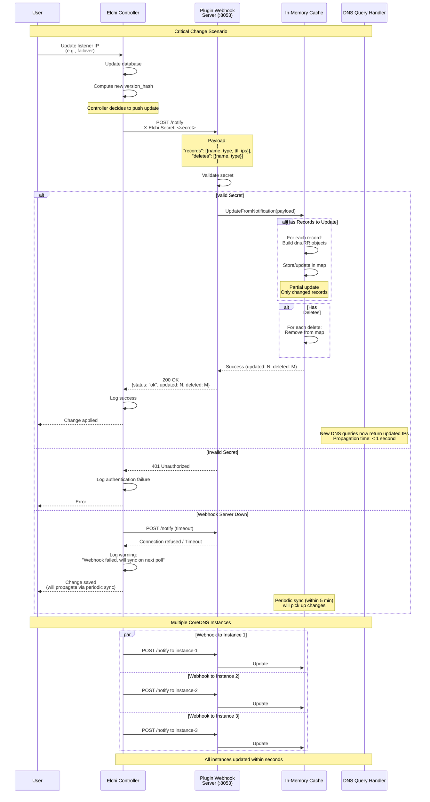

# Webhook Update Flow

This diagram shows instant updates via webhook for low-latency propagation.

## Key Points

1. **Low latency**: Changes propagate in <1 second
2. **Partial updates**: Only send changed/deleted records
3. **Parallel updates**: Controller notifies all instances concurrently
4. **Fault tolerant**: Webhook failures don't block changes
5. **Security**: Secret-based authentication
6. **Fallback**: Periodic sync ensures eventual consistency if webhook fails
7. **Idempotent**: Multiple notifications of same change are safe

## Webhook vs Periodic Sync

| Aspect | Webhook | Periodic Sync |
|--------|---------|---------------|
| Latency | <1 second | Up to 5 minutes |
| Network usage | On-demand | Every 5 minutes |
| Reliability | Optional | Required |
| Use case | Critical updates | Normal updates |
| Failure impact | Falls back to sync | DNS stops updating |
