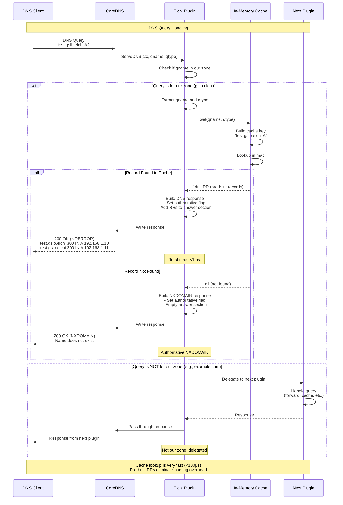
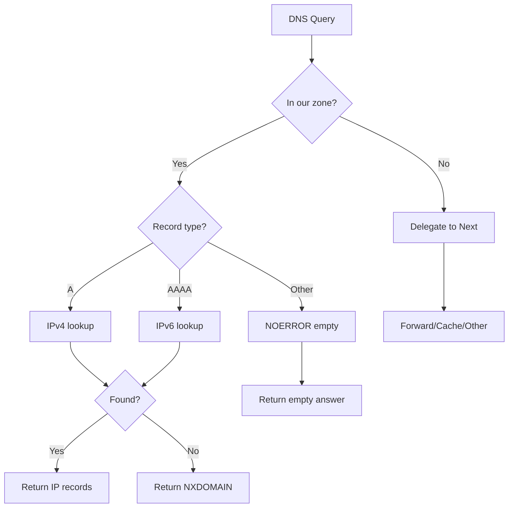

# DNS Query Flow

This diagram shows how incoming DNS queries are handled by the plugin.



## Performance Breakdown

```
Total query latency: ~500μs - 1ms

Breakdown:
- Zone check:           ~10μs   (string comparison)
- Cache lookup:         ~50μs   (map lookup)
- Response building:    ~100μs  (copy pre-built RRs)
- DNS encoding:         ~300μs  (miekg/dns library)
- Network write:        ~50μs   (local buffer)
```

## Query Types Handled



## Key Points

1. **Fast path**: Cache lookup is the only I/O operation
2. **Pre-built records**: No parsing or building during query
3. **Authoritative responses**: Plugin is authoritative for its zone
4. **Zone delegation**: Queries for other zones delegated to next plugin
5. **Zero network calls**: All data from in-memory cache
6. **Thread-safe**: RWMutex allows concurrent reads
