# Error Recovery Flow

This diagram shows graceful degradation and automatic recovery from failures.

```mermaid
sequenceDiagram
    participant Timer as Sync Timer
    participant Plugin as Elchi Plugin
    participant Cache as In-Memory Cache
    participant Controller as Elchi Controller
    participant Client as DNS Client

    Note over Timer,Client: Normal Operation

    Timer->>Plugin: Sync trigger
    Plugin->>Controller: GET /dns/changes
    Controller-->>Plugin: 200 OK (data)
    Plugin->>Cache: Update cache
    Client->>Plugin: DNS query
    Plugin->>Cache: Get records
    Cache-->>Plugin: Records
    Plugin-->>Client: DNS response

    Note over Controller: Controller becomes unavailable<br/>(crash, network partition, deployment)

    rect rgb(255, 230, 230)
        Note over Timer,Client: Degraded Operation

        Timer->>Plugin: Sync trigger
        activate Plugin

        Plugin->>Controller: GET /dns/changes
        Controller-->>Plugin: Timeout / Connection refused

        Plugin->>Plugin: Log error:<br/>"Sync failed: connection timeout"
        Plugin->>Plugin: Update sync_status = "failed"
        Plugin->>Plugin: Increment elchi_sync_failure_total

        Note over Plugin: Decision: Serve stale cache

        Plugin->>Plugin: DO NOT clear cache<br/>DO NOT return error<br/>DO NOT stop serving

        deactivate Plugin

        Client->>Plugin: DNS query (during outage)
        activate Plugin

        Plugin->>Cache: Get records (stale but valid)
        activate Cache
        Cache-->>Plugin: Stale records
        deactivate Cache

        Plugin-->>Client: DNS response (stale data)

        Note over Client: Client receives valid response<br/>Application continues working

        deactivate Plugin

        Note over Plugin: Health endpoint shows degraded state

        Client->>Plugin: GET /health
        activate Plugin

        Plugin-->>Client: 503 Service Unavailable<br/>{<br/>  "status": "degraded",<br/>  "last_sync_status": "failed",<br/>  "error": "connection timeout"<br/>}

        deactivate Plugin
    end

    Note over Timer,Client: Multiple Failed Sync Attempts

    loop Every 5 minutes
        Timer->>Plugin: Sync trigger
        Plugin->>Controller: GET /dns/changes
        Controller-->>Plugin: Still failing

        Plugin->>Plugin: Log error (with backoff)
        Plugin->>Plugin: Continue serving stale cache

        Note over Cache: Cache age increasing<br/>Metrics: elchi_cache_age_seconds++
    end

    Note over Controller: Controller recovers<br/>(restarted, network restored)

    rect rgb(230, 255, 230)
        Note over Timer,Client: Recovery

        Timer->>Plugin: Sync trigger
        activate Plugin

        Plugin->>Controller: GET /dns/changes?since=old_hash
        activate Controller

        Controller->>Controller: New data available

        Controller-->>Plugin: 200 OK<br/>{version_hash: "new", records: [...]}
        deactivate Controller

        Plugin->>Cache: ReplaceFromSnapshot(new_data)
        activate Cache

        Cache->>Cache: Clear old (stale) cache
        Cache->>Cache: Load fresh records

        Cache-->>Plugin: Success
        deactivate Cache

        Plugin->>Plugin: Log info:<br/>"Recovered from degraded state"
        Plugin->>Plugin: Update sync_status = "success"
        Plugin->>Plugin: Reset elchi_sync_failure_total

        deactivate Plugin

        Note over Plugin: System fully recovered

        Client->>Plugin: DNS query (after recovery)
        Plugin->>Cache: Get records (fresh)
        Cache-->>Plugin: Fresh records
        Plugin-->>Client: DNS response (updated data)

        Client->>Plugin: GET /health
        Plugin-->>Client: 200 OK<br/>{<br/>  "status": "healthy",<br/>  "last_sync_status": "success"<br/>}
    end

    Note over Timer,Client: Normal operation resumed
```



## Failure Scenarios

### Scenario 1: Temporary Network Glitch
- **Duration**: 1-2 sync intervals (5-10 minutes)
- **Impact**: Minimal, stale data served
- **Recovery**: Automatic on next successful sync

### Scenario 2: Controller Deployment
- **Duration**: 5-15 minutes
- **Impact**: DNS continues with old data
- **Recovery**: Automatic when controller restarts

### Scenario 3: Extended Outage
- **Duration**: Hours
- **Impact**: Stale data served, alerts triggered
- **Recovery**: Automatic when connectivity restored

### Scenario 4: Partial Failure (Some Records)
- **Duration**: Varies
- **Impact**: Some queries return NXDOMAIN
- **Recovery**: Full snapshot on next sync

## Key Points

1. **Never fail closed**: Always serve DNS, even with stale data
2. **Self-healing**: Automatically recovers when controller available
3. **Observable**: Health endpoint shows degraded state
4. **Metrics tracking**: Prometheus metrics for monitoring
5. **No manual intervention**: Recovery is automatic
6. **Graceful**: No service interruption during failures

## Monitoring and Alerting

### Recommended Alerts

```yaml
# Alert on consecutive sync failures
- alert: ElchiSyncFailing
  expr: elchi_sync_failure_total > 3
  for: 5m
  severity: warning
  annotations:
    summary: "Elchi plugin failing to sync"
    description: "{{ $value }} consecutive sync failures"

# Alert on stale cache
- alert: ElchiCacheStale
  expr: (time() - elchi_last_sync_timestamp) > 900  # 15 minutes
  severity: warning
  annotations:
    summary: "Elchi cache is stale"

# Alert on degraded health
- alert: ElchiDegraded
  expr: elchi_health_status == 0
  for: 10m
  severity: critical
  annotations:
    summary: "Elchi plugin in degraded state"
```
